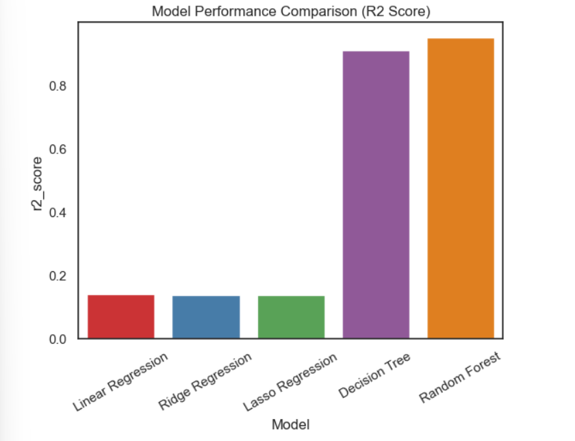

# Supply Chain Sales Forecasting — Walmart Weekly Sales Prediction

> Predicting weekly retail sales across 45 Walmart stores using 5 regression models — with Random Forest achieving **R2 = 0.95** and **RMSE = 124,794**.

---

## Business Problem

A wrong weekly sales forecast has a direct cost: overstock fills warehouses with stock that does not move, and stockout loses revenue at the shelf. At Walmart's scale, small errors multiply fast across store-weeks.

This project builds and compares 5 regression models on 3 years of Walmart store-level data to find the most accurate weekly sales forecast, and to understand why tree-based models outperform linear ones by 6.8x.

---

## Dataset

- **Source:** Walmart Sales Dataset (Kaggle)
- **Size:** 6,435 records x 8 columns | Stores: 45 | Period: Feb 2010 to Oct 2012
- **No missing values** across all 8 columns
- **Target Variable:** `Weekly_Sales` (range: $209K to $3.8M per store per week)

| Column | Description |
|---|---|
| `Store` | Store number (1 to 45) |
| `Date` | Week start date |
| `Weekly_Sales` | Sales for the given store-week |
| `Holiday_Flag` | 1 = holiday week, 0 = non-holiday (450 holiday vs 5,985 non-holiday weeks) |
| `Temperature` | Regional temperature (Fahrenheit) |
| `Fuel_Price` | Regional fuel cost |
| `CPI` | Consumer Price Index |
| `Unemployment` | Regional unemployment rate |

---

## Feature Engineering

The raw dataset had 8 columns, one of which was a date string. Here is what was built and why:

- **Date decomposition:** Parsed `Date` into `Year`, `Month`, and `Week_No`. A raw date string has no numerical signal for a regression model, but week number and month capture the seasonal patterns that drive retail sales
- **Aggregated sales features:** Engineered `Yearly_Sales` and `Monthly_Sales` by grouping on time periods and merging back into the row-level dataframe. Each weekly record then carries that store's cumulative sales pace for the month and year, which helps the model separate a slow week in a strong month from a genuinely weak period
- **Outlier removal:** Applied IQR-based capping (1.5x factor) on `Weekly_Sales`, `Temperature`, and `Unemployment`. Boxplot inspection confirmed outliers in these three columns specifically
- **Data leakage prevention:** `Yearly_Sales` and `Monthly_Sales` were dropped from the feature set after engineering. Keeping aggregated sales columns as inputs would leak target-correlated information into training — the model would be learning from the answer, not the drivers

Final feature set: `Store`, `Holiday_Flag`, `Temperature`, `Fuel_Price`, `CPI`, `Unemployment`, `Year`, `Month`, `Week_No`

---

## Models Trained & Results

80/20 train-test split. `StandardScaler` applied before training on all models.

| Model | RMSE | R2 Score |
|---|---|---|
| Linear Regression | 518,021 | 0.1392 |
| Ridge Regression (alpha=10) | 518,120 | 0.1389 |
| Lasso Regression (alpha=10) | 518,136 | 0.1388 |
| Decision Tree | 167,187 | 0.9103 |
| **Random Forest (100 trees)** | **124,795** | **0.9500** |



All three linear models landed at R2 of about 0.14. That is not a tuning problem. It means the relationships between store, week, holiday timing, and sales are non-linear, and linear regression has no way to capture that. The 6.8x gap between linear and tree-based models is the evidence.

**PCA Experiment (5 components):** R2 dropped to 0.50. Reducing dimensions collapsed the time and seasonality features that carry most of the predictive signal. PCA was ruled out for this dataset.

**Lasso note:** Lasso hit a convergence warning at `max_iter=100`. The result is directionally correct but the model was not fully optimised. Flagged for a fix by increasing `max_iter`.

**Winner: Random Forest** — lowest RMSE, highest R2.

---

## Business Insights

**1. Holiday weeks are a small share of the data but drive outsized revenue**
Only 7% of weeks have a holiday flag (450 of 6,435). November and December show the sharpest single-week sales spikes in the dataset. Getting the forecast wrong in those weeks has more impact than errors spread across most of the rest of the year.

**2. December is the highest-revenue month, by a clear margin**
December 2010 ($288M) and December 2011 ($288M) are the two highest monthly totals in the entire dataset — roughly 40 to 58% above the average month (~$183M). A single bad December forecast costs more operationally than several ordinary months combined.

**3. CPI and fuel price move with sales and show up in the correlation heatmap**
Total sales: $2.29B (2010), $2.45B (2011), $2.0B (2012, data ends October). The 2012 figure is a partial year, not a confirmed decline. The heatmap shows a measurable negative correlation between CPI/Fuel_Price and Weekly_Sales — both columns are worth tracking as forward inputs when retraining, not just as historical background.

The dataset covers 2010 to 2012. The model structure is transferable, but feature weights would shift on current data given changes in e-commerce share, fuel prices, and post-COVID consumer patterns.

---

## Tech Stack

Python 3 | Pandas | NumPy | Matplotlib | Seaborn | Scikit-learn | Joblib | Jupyter Notebook

---

## Project Structure

```
ML-Supply-Chain-Sales-Forecasting/
|
|-- Code file/
|   |-- Supply_Chain_Sales_Forecasting_using_ML_Algorithms.ipynb   # Main notebook
|-- data/
|   |-- Walmart.csv                                                  # Dataset
|-- image/
|   |-- model_comparison.png                                         # Model R2 comparison chart
|-- README.md
```

---

## How to Run

```bash
# 1. Clone the repository
git clone https://github.com/Tisha34/ML-Supply-Chain-Sales-Forecasting.git
cd ML-Supply-Chain-Sales-Forecasting

# 2. Install dependencies
pip install pandas numpy matplotlib seaborn scikit-learn joblib jupyter

# 3. Launch the notebook
jupyter notebook "Code file/Supply_Chain_Sales_Forecasting_using_ML_Algorithms.ipynb"
```

---

## What I'd Fix Next

All three linear models scored R2 = 0.14 while Random Forest scored 0.95. That 6.8x gap points to non-linear interactions between store, week number, and holiday timing that linear models cannot learn. The next steps follow from that finding:

- Run GridSearchCV on Random Forest (`n_estimators`, `max_depth`, `min_samples_split`) to find out how much of the remaining RMSE of 124,795 is a tuning gap versus a data ceiling
- Test XGBoost with explicit interaction features between `Holiday_Flag x Week_No` and `Store x Month` to see whether gradient boosting closes the gap further
- Increase `max_iter` on Lasso and check whether regularisation adds anything over standard Linear Regression once it fully converges
- Add a store-level feature importance plot. The current model takes Store as a single numeric input across all 45 locations. Knowing which stores are hardest to forecast is more useful than one aggregate R2 score

---

Dataset: [Kaggle — Walmart Sales Forecasting](https://www.kaggle.com/datasets/yasserh/walmart-dataset)
